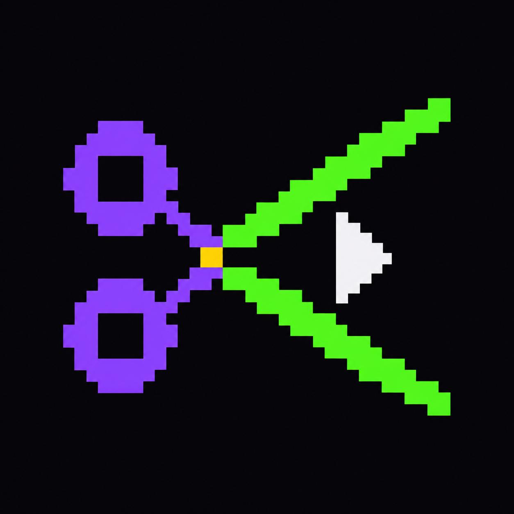
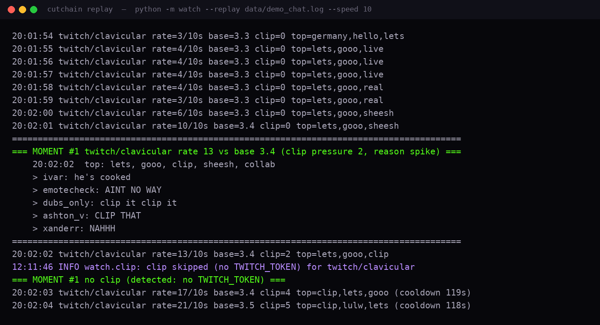
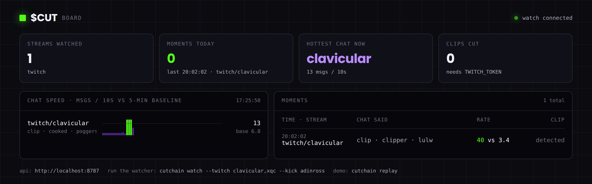
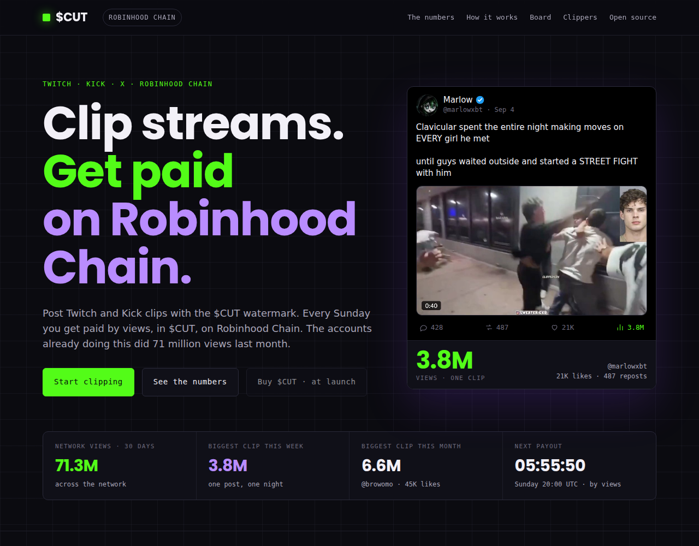
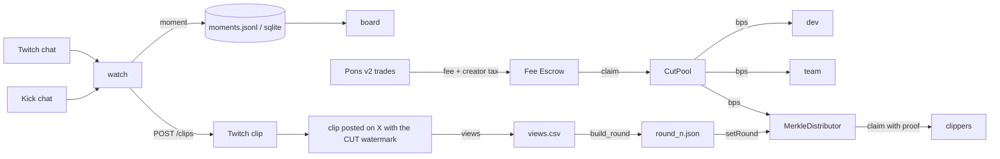

<p align="center">
  
</p>


<p align="center">
  <a href="https://cutchain.live">cutchain.live</a> ·
  <a href="./docs/CLIPPERS.md">rules for clippers</a> ·
  <a href="./docs/PAYOUTS.md">weekly payouts</a> ·
  <a href="./docs/LAUNCH.md">launch checklist</a> ·
  <a href="./docs/ARCHITECTURE.md">architecture</a>
</p>

<p align="center">
  
  
  
  
  
  
</p>

Twitch belongs to Amazon. Kick belongs to a casino. The moments that do millions of views a
month belong to nobody, and the people who cut and post them get a notification. cutchain is
the pipe that turns that into money on Robinhood Chain: a watcher reads Twitch and Kick chat
and logs the moment when chat spikes, clippers post the clip with the `CUT` watermark, the
token's trading fees land in an immutable splitter, and every Sunday the clipper share is paid
out by views through a Merkle round. Local, open, non-custodial, dry run by default.

The tool works without owning any token. Nothing here is financial advice and nothing here
promises a payout: the clipper pool is exactly as big as the week's fees.

## Install

```sh
git clone https://github.com/Izaneluhin/cutchain && cd cutchain
npm install                      # root CLI, no dependencies
pip install -r watch/requirements.txt
cd mint && npm install && cd ..
cd contracts && forge install foundry-rs/forge-std --no-git && cd ..
cp .env.example .env             # or the per-module .env.example files
node bin/cutchain.js doctor
```

`npm link` makes `cutchain` a global command. Everything below assumes it is.

## Sixty seconds

```sh
cutchain doctor                  # python, node, forge, deps, RPC (expects chain id 4663)
cutchain replay                  # 3 minutes of recorded chat at 10x, one moment fires
cutchain board                   # http://127.0.0.1:8788, reads the watcher's API
cutchain watch --twitch clavicular,xqc --kick adinross
cutchain launch --name CUT --symbol CUT --creator-tax-bps 300 --dry-run
```

No key is needed for any of that. Clip creation needs a Twitch token, launching needs a wallet
with ETH on Robinhood Chain, and both stay in `.env` files that are gitignored.

## Commands

| Command | What it does | Needs |
|---|---|---|
| `doctor` | Checks toolchain, dependencies, env files and probes the RPC | nothing |
| `watch --twitch a,b --kick c` | Reads chat, measures speed, logs moments, cuts clips | `TWITCH_TOKEN` only for clips |
| `replay` | Replays `watch/data/demo_chat.log` through the same detector | nothing |
| `board [--port 8788]` | Serves the live board for the watcher API | nothing |
| `launch --name --symbol [--creator-tax-bps] [--buybacks] [--dev-buy-eth] [--dry-run]` | Launches the token on Pons v2 | `PRIVATE_KEY` unless `--dry-run` |
| `status --token 0x…` | Curve progress, price, graduation, accrued fees | nothing |
| `claim --token 0x… [--sweep]` | Withdraws accrued creator fees from the Fee Escrow | `PRIVATE_KEY` |
| `pool --token 0x… [--quote 0x…] --price` | Opens the Uniswap V3 side pool against a Stock Token (default AMZN) | `PRIVATE_KEY` unless `--dry-run` |
| `round <views.csv> <id> --total <wei>` | Builds a weekly payout round (root, amounts, proofs) | nothing |
| `test` | watch tests, `forge test`, mint typecheck | nothing |

## watch



The watcher joins Twitch chat anonymously (no token, any channel) and Kick chat through its
websocket. Per channel it keeps a 10-second message rate, a 5-minute baseline, the hot words of
the last 30 seconds and a "clip pressure" counter (how many people typed `clip it`). A moment
fires when the rate is at least three times the baseline (minimum 12 messages per 10 seconds)
or when clip pressure crosses five. Cooldown is two minutes per channel, warm-up is thirty
seconds so big channels do not fire at startup.

When a moment fires and `TWITCH_CLIENT_ID` / `TWITCH_TOKEN` exist, the watcher calls the Helix
`POST /clips` endpoint immediately: Twitch clips capture the ninety seconds before the call, so
firing late means missing the moment. Without a token the moment is still logged as `detected`.
Every moment goes to `watch/data/moments.jsonl` and a SQLite table, and the API on port 8787
serves `GET /api/live`, `GET /api/moments?limit=50` and `GET /api/health`.

```sh
cutchain watch --twitch clavicular,xqc --kick adinross --port 8787
cutchain watch --twitch kaicenat --record watch/data/chat.log     # record a real night
cutchain watch --replay watch/data/chat.log --speed 5              # replay it, same detector
```

Thresholds live in `watch/config.yaml`. Details, API shapes and the Kick caveats are in
[`watch/README.md`](./watch/README.md).

## board



`cutchain board` serves a single page that polls the watcher: chat speed per stream against
its baseline, the hottest chat right now, every moment with its words and its clip. It is the
same board that ships on [cutchain.live](https://cutchain.live), pointed at a live watcher
instead of demo data. Pass `?api=http://host:8787` to point it at a watcher on another machine.

## contracts

Two contracts, no dependencies, no owner where an owner is not needed.

**`CutPool`** is the fee splitter. Recipients and basis points are set in the constructor and
can never change: no owner, no setters, no upgrade path, no generic `execute`. It accepts ETH
and any ERC-20, and anyone can call `distribute()` / `distributeToken(token)` to split the
balance. Rounding dust goes to the last recipient, so nothing is stranded. If the token's fee
recipient on Pons is the pool itself, nobody has to trust anybody with the creator share.

**`MerkleDistributor`** pays the clippers. Each Sunday the operator publishes a round: a Merkle
root over `(index, account, amount)`, the total, and a claim deadline. Clippers claim their own
share with a proof from the published round file; after the deadline the owner sweeps the
unclaimed remainder to an address of their choice (in practice: the next round). A round id can
be set once.

```sh
cd contracts
forge test -vv                                   # 52 tests
forge script script/Deploy.s.sol --rpc-url $RPC_URL --broadcast --verify
```

`tooling/build_round.py` turns a `views.csv` (`address,handle,views`) into `round_<n>.json`
with the root, every amount and every proof. `cutchain round` wraps it. The weekly runbook is
[`docs/PAYOUTS.md`](./docs/PAYOUTS.md), deployment is [`contracts/deploy.md`](./contracts/deploy.md).

## mint

Launch, status and claim scripts for **Pons v2** on Robinhood Chain, written against the
published v2 source and the docs, with every write guarded: the target selector must exist in
the deployed bytecode and the simulation must pass before anything is sent.

```sh
cutchain launch --name CUT --symbol CUT --creator-tax-bps 300 --buybacks --dry-run
cutchain launch --name CUT --symbol CUT --creator-tax-bps 300 --buybacks --dev-buy-eth 0.2
cutchain status --token 0x…
cutchain claim  --token 0x… --sweep
cutchain pool   --token 0x… --fee 10000 --price 0.001 --dry-run     # quote defaults to the AMZN Stock Token
```

What the fee model looks like on v2, per trade on the quote leg: a curve fee and an optional
creator tax, both fixed at launch. Pons takes its share of the fee first, an optional buyback
slice is spent buying the token back, and the rest plus the whole creator tax goes to the
creator. `launch --dry-run` prints the split with the live policy and a 1 ETH example.
Launches open behind a snipe tax that starts at 99 % and decays to zero over the first
seconds, and the launcher is exempt, which is what `--dev-buy-eth` is for.

The first real run should be a throwaway token: it costs the launch fee and proves the ABI
against the deployed contracts. [`mint/CHAIN.md`](./mint/CHAIN.md) lists every address and
what is verified against which source.

## site



`site/` is the landing page at [cutchain.live](https://cutchain.live): the numbers, the three
steps, the demo board, the rules and the clipper registration form. Static, one file plus
images, deployable anywhere. `python3 site/build.py` rebuilds `index.html` from
`fragment.src.html`.

## How it works



Ports, paths and environment variables per module are in
[`docs/ARCHITECTURE.md`](./docs/ARCHITECTURE.md).

## Numbers behind the defaults

| | |
|---|---|
| Spike rule | rate ≥ max(12 msgs / 10 s, 3 × baseline) or clip pressure ≥ 5 |
| Baseline | 5-minute EMA, seeded after the first full window |
| Cooldown / warm-up | 120 s / 30 s per channel |
| Clip window | Twitch keeps ~90 s before the `POST /clips` call |
| Payout | Sunday 20:00 UTC, by verified views, minimum 10,000 views per clip |
| Chain | Robinhood Chain, id 4663, Arbitrum Nitro L2 |
| Contract tests | 52 (`forge test`) |

## Tests

```sh
cutchain test
```

Runs the watcher's offline checks (protocol handshake, detector, replay, API), `forge test` in
`contracts/` and the TypeScript typecheck plus the dry-run suite in `mint/`. CI does the same
on every push (`.github/workflows/ci.yml`).

## FAQ

**Does the watcher need a Twitch account?** No. Reading chat is anonymous. Creating clips needs
a user token with `clips:edit`.

**Can it post to X?** No, and it will not. Posting stays with the person who runs the account.

**Does it launch tokens by itself?** No. `launch` is a script you run once, with `--dry-run`
first, with your own key, and it refuses to send if the on-chain contract does not match what
it expects.

**Where do the payouts come from?** From the token's trading fees and creator tax, nothing
else. No fees, no pool. The split is in the contract and cannot be changed after deployment.

**Do I need the token to use the code?** No.

## Built on

| | |
|---|---|
| Robinhood Chain | [docs.robinhood.com/chain](https://docs.robinhood.com/chain) |
| Pons v2 | [docs.ponsfamily.com/v2](https://docs.ponsfamily.com/v2) |
| Twitch Helix and IRC | [dev.twitch.tv](https://dev.twitch.tv/docs/) |
| Uniswap V3 / V4 on Robinhood Chain | [github.com/Uniswap/contracts](https://github.com/Uniswap/contracts) |
| viem, aiohttp, websockets, Foundry | their respective authors |

## License

MIT. See [LICENSE](./LICENSE).
