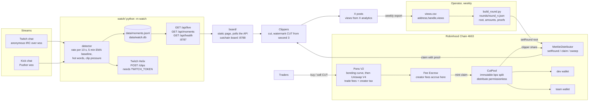

# Architecture

cutchain is four small modules and one static site. Chat goes in on the left, CUT goes out to
clippers on the right, and nothing in between is hidden.

Two loops meet in the middle. The content loop: chat spikes, the watcher logs the moment, the board
shows it, a clipper cuts and posts it, X counts the views. The money loop: traders pay fees on CUT, the
creator fees reach CutPool, CutPool splits them, the distributor pays the clipper share out by views.

## Modules

### `watch/` (Python 3.11, asyncio)

Reads Twitch chat anonymously (`NICK justinfan…`, no token) and Kick chat through Kick's public Pusher
endpoint, best effort. Per channel it keeps the message rate over 10 s, an exponential baseline with a
5-minute time constant, the top words of the last 30 s, and the count of "clip it" style messages. A
moment fires when `rate >= max(min_rate, spike_factor * baseline)` or `clip_pressure >= clip_threshold`,
after a 30 s warm-up and with a 120 s per-channel cooldown. Moments are appended to `data/moments.jsonl`
and upserted in `data/watch.db`. With `TWITCH_CLIENT_ID` and `TWITCH_TOKEN` set, a Twitch clip is
requested through Helix the moment it fires; without them the moment is stored with `status=detected`.
Kick has no clip API. `--replay` runs a recorded log on a virtual clock; `data/demo_chat.log` fires
exactly one moment. Details: `watch/README.md`.

### `board/`

A static page. It polls `GET /api/live` and `GET /api/moments` on the watch API and reads the chain for
rounds and claims. `node bin/cutchain.js board` serves the folder with a dependency-free static server.
Built separately; not part of this document's scope.

### `contracts/` (Foundry, Solidity 0.8.30)

`CutPool` holds any ETH or ERC-20 that lands in it and lets anyone split it across a fixed recipient
list by basis points set in the constructor (no owner, no setters). Its only outbound call is a
selector-locked `claim(bytes)` to `claimTarget`, for the mode where CutPool itself is the creator fee
recipient. `MerkleDistributor` runs weekly rounds: the owner calls `setRound` once per id with a Merkle
root, the payout token, the total and a deadline; the contract must already hold the total on top of
older open rounds. Anyone can `claim(roundId, index, account, amount, proof)`; funds go to `account`.
After the deadline the owner can `sweep` the unclaimed remainder. `tooling/build_round.py` turns a
`views.csv` into `round_<n>.json` with the same leaf encoding as the contract. 52 tests.
Details: `contracts/README.md`, `contracts/deploy.md`.

### `mint/` (TypeScript, viem)

`launch.ts` calls `PonsV2LaunchFactory.launchToken` with the name, symbol, metadata, creator fee
recipient, creator tax and buyback flag, after reading the live launch fee, the enabled launch configs
and the fee policy. `status.ts` prints the curve progress, price, graduation phase, escrow balance and
V4 pool id. `claim.ts` withdraws creator fees from the Fee Escrow (`claim()` for ETH pairs). `pool.ts`
opens an optional Uniswap V3 side pool against a Stock Token (AMZN by default). Every write script
prints calldata, simulates, and refuses to send when the selector is absent from the target bytecode or
the simulation fails. `--dry-run` sends nothing. Details: `mint/README.md`, `mint/CHAIN.md`.

### `site/`

The landing page at https://cutchain.live: the rules for clippers, the registration form (posts to a
Google Apps Script), the numbers, and a demo board. `site/index.html` is built from
`site/fragment.src.html` by `site/build.py`; `site/fragment.html` is the same page with images inlined.

### `bin/cutchain.js`

Dispatcher, no dependencies. `watch`, `replay`, `board`, `launch`, `status`, `claim`, `pool`, `round`,
`test`, `doctor`. See `node bin/cutchain.js help`.

## Ports, paths, environment

| Module | Port | Paths | Environment variables |
|---|---|---|---|
| `watch/` | `8787` HTTP API (`--port`, `--host`, default `0.0.0.0`) | `watch/config.yaml`, `watch/data/moments.jsonl`, `watch/data/watch.db`, `watch/data/demo_chat.log`, `--record` / `--replay` paths relative to `watch/` | `TWITCH_CLIENT_ID`, `TWITCH_TOKEN` (`watch/.env`; optional, clips only) |
| `board/` | `8788` static (`cutchain board --port`) | `board/index.html` | none; the page targets the watch API URL |
| `contracts/` | none | `contracts/src`, `contracts/test`, `contracts/lib/forge-std` (installed, gitignored), `contracts/out`, `contracts/broadcast`, `contracts/tooling/build_round.py`, `rounds/round_<n>.json` | `RPC_URL`, `CHAIN_ID`, `VERIFIER_URL`, `PRIVATE_KEY`, `DEV`, `TEAM`, `CLIPPER_POOL`, `BPS_DEV`, `BPS_CLIPPER`, `BPS_TEAM`, `CLAIM_TARGET`, `CLAIM_SELECTOR`, `DEPLOY_DISTRIBUTOR`, `DISTRIBUTOR_OWNER`, `WETH`, `PONS_V1_FACTORY`, `PONS_V1_LOCKER` (`contracts/.env`) |
| `mint/` | none (RPC client only) | `mint/*.ts`, `mint/lib`, `mint/abi`, `mint/node_modules` | `RPC_URL`, `PRIVATE_KEY`, optional address overrides `PONS_V2_FACTORY`, `PONS_V2_MEME_HOOK`, `PONS_V2_FEE_ESCROW`, `PONS_V2_BUYBACK_VAULT`, `PONS_V2_LAUNCH_LOCKER`, `PONS_V2_LAUNCH_AND_BUY`, `PONS_FACTORY`, `PONS_LOCKER`, `LOCKER_CLAIM_SIGNATURE`, `FEE_WALLET`, `WETH`, `UNISWAP_V3_FACTORY`, `NONFUNGIBLE_POSITION_MANAGER`, `AMZN` (`mint/.env`) |
| `site/` | static hosting | `site/index.html`, `site/img/` | none |

External endpoints:

| Endpoint | Used by |
|---|---|
| `wss://irc-ws.chat.twitch.tv:443` | `watch/twitch.py` |
| `https://api.twitch.tv/helix/users`, `https://api.twitch.tv/helix/clips` | `watch/clip.py` (with credentials) |
| `https://kick.com/api/v2/channels/<slug>`, `wss://ws-us2.pusher.com/app/32cbd69e4b950bf97679` | `watch/kick.py` |
| `https://rpc.mainnet.chain.robinhood.com` (chain id 4663) | `mint/`, `contracts/` scripts, `cutchain doctor` |
| `https://robinhoodchain.blockscout.com` | explorer links, contract verification |

Chain constants and Pons addresses are listed with sources in `contracts/deploy.md` section 0 and `mint/CHAIN.md`.

## Money flow, precisely

1. A trade on the CUT curve (or, after graduation, on the Uniswap V4 pool through the Pons meme hook) pays
   the base fee plus the creator tax. At sweep the creator part is credited to the Pons Fee Escrow under the
   creator fee recipient.
2. The creator fee recipient withdraws with `mint/claim.ts` (`claim()`), in mode A the dev wallet.
3. The clipper budget is sent to CutPool. Anyone calls `distribute()` (ETH) or `distributeToken(token)`;
   CutPool pays dev, team and the MerkleDistributor by the immutable bps.
4. The operator exports views, runs `build_round.py`, publishes `rounds/round_<n>.json`, calls `setRound`.
5. Clippers claim with their proof until the deadline. The owner sweeps the remainder into the next round.

Where the dev is trusted (mode A: forwarding the share; publishing an honest root) and where nobody is
(the split, the round funding rule, the claim) is spelled out in `contracts/README.md`, "Trust model".
